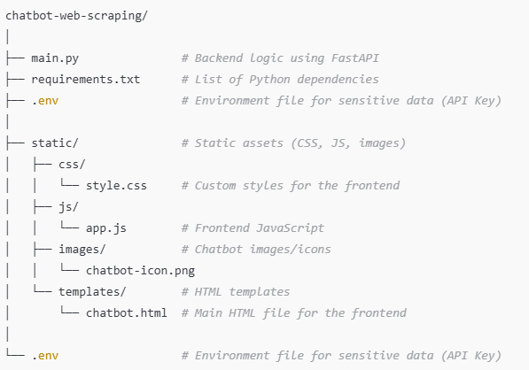

# TravelloFoodie - Your Guide - Chatbot with Web Scraping and Conversational Retrieval

### This solution is built using completely open-source technologies

This project implements a chatbot that retrieves answers from a specified website's content using web scraping and conversational retrieval techniques. It uses **LangChain** for building the conversational logic, **Chroma** for vector-based document retrieval, **FastAPI** for serving the backend, and HTML, CSS, Javascript  for creating a user-friendly front-end interface.

---

## Table of Contents

1. [Overview](#overview)
2. [Requirements](#requirements)
3. [Installation](#installation)
4. [Project Structure](#project-structure)
5. [Usage](#usage)
6. [Endpoints](#endpoints)
7. [License](#license)

---

## Overview

This chatbot allows users to ask questions, and it retrieves answers based on the content scraped from a provided website. It uses a combination of web scraping, document chunking, vectorization, and a conversational chain to provide accurate, context-based answers to user queries.

Key Features:

- Web scraping: Extracts all internal links from a provided website and loads the content.
- Conversational retrieval: Uses a retrieval chain to maintain context and answer questions from the website content.
- FastAPI backend: Serves as the API to process user requests.
- Static assets: Uses `HTML`, `CSS`, and `JavaScript` for frontend interaction.

## Requirements

```bash
pip install -r requirements.txt
```

---

## Installation

### 1. Clone the repository:

```bash
git clone https://github.com/ManideepMuddagowni/TravelloFoodie---Your-Guide-Chatbot.git
cd TravelloFoodie - Your-Guide-Chatbot.git
```

### 2. Install dependencies:

```bash
pip install -r requirements.txt
```

### 3. Create a `.env` file in the root of the project and add your API key:

```plaintext
hf_token = ""
GROQ_API_KEY = ""
```

---

## Project Structure

The project follows a structured directory layout:TravelloFoodie - Your Guide -web-scraping
chatbot



---

## Usage

### 1. Start the server:

Run the server with:

```bash
uvicorn main:app --reload
```

This will start the API on `http://127.0.0.1:8000`. You can then interact with the chatbot through the provided frontend.

### 2. Start the server using FASTAPI

`uvicorn main:app --reload`

This will start the API on `http://127.0.0.1:8000/docs`. Insert the URL which you want to scrape in `/get_all_links/` [POST] You can then interact with the chatbot through the provided Swagger UI.

### 3. Open the frontend:

Open your browser and navigate to the provided URL to interact with the chatbot:

```
http://127.0.0.1:8000/
```

### 4. Ask questions:

The chatbot will retrieve answers based on the content scraped from the website, provided as part of the backend logic. The conversation is stored as a chat history, ensuring context is preserved during the conversation.

---

## Endpoints

### `/get_response/` [POST]

This endpoint generates a response to the user's question based on the scraped website content.

- **Request body**: JSON with a `question` field.

  ```json
  {
    "question": "What is Travello Foodie?"
  }
  ```
- **Response**: JSON with the AI-generated answer.

  ```json
  {
    "answer": "Travello Foodie is a travel and food guide platform..."
  }
  ```

### `/get_all_links/` [POST]

This endpoint fetches all internal links from a given URL. It scrapes the website and returns a list of links that are relevant for further scraping.

- **Request body**: JSON with a `question` field (URL).

  ```json
  {
    "question": "https://www.travellofoodie.com/"
  }
  ```
- **Response**: JSON with a list of internal links.

  ```json
  {
    "links": ["https://www.travellofoodie.com/about", "https://www.travellofoodie.com/destinations"]
  }
  ```

### `/static` [GET]

This serves static assets like CSS, JavaScript, and images for the chatbot frontend.

---

## License

This project is licensed under the MIT License - see the [LICENSE](LICENSE) file for details.
